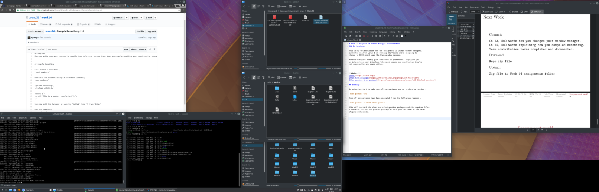
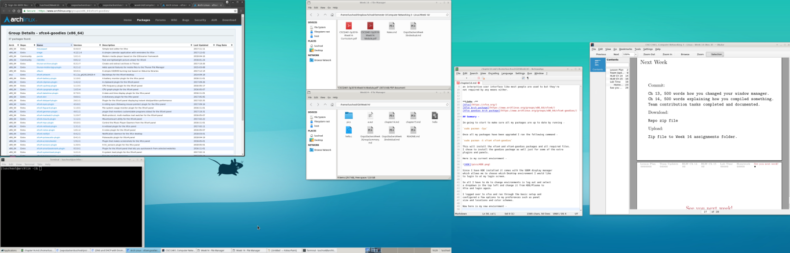

# Week 14 Chapter 14 Window Manager documentation
### By Luschool

This is my documentation for the assignment to change window managers.
Currently on Arch Linux I am running KDE/Plasma and I am going to 
change to XFCE which uses the Xfwm window manager.

Windows managers mostly just come down to preference. They give you 
an interactive user interface like most people are used to but they're 
not required by any means either. 

**Links -**
[Xfce](https://xfce.org/)
[Xfce Arch package](https://www.archlinux.org/groups/x86_64/xfce4/)
[Xfce goodies Arch package](https://www.archlinux.org/groups/x86_64/xfce4-goodies/)

## Summary -  

Im going to start to make sure all my packages are up to date by running -

`sudo pacman -Syu`

Once all my packages have been upgraded I ran the following command -

`sudo pacman -S xfce4 xfce4-goodies`

This will install the xfce4 and xfce4-goodies packages and all required files. 
I chose to install the goodies package as well just for some of the extra
plugins and panels. 

Here is my current enviornment - 

Since I have KDE installed it comes with the SDDM display manager
which allows me to choose which Desktop environment I would like
to login to at my login screen. 

So all I have to do to change environments is log out and select
a dropdown in the top left and change it from KDE/Plasma to 
Xfce and login again.

I logged over to xfce and ran through the basic setup and 
configured a few options to my preferences such as panel
size and locations and color schemes. 

Now here is my new enviornment - 

As of right now I prefer my KDE configuration. They both have
some bloat applications but the look and feel of KDE is more what
I prefer. This will certainly get me interested in customizing
my KDE more though to get it exactly how I want it. 
